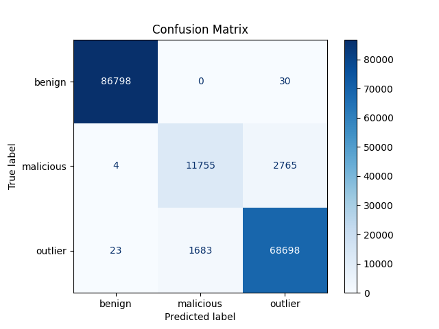
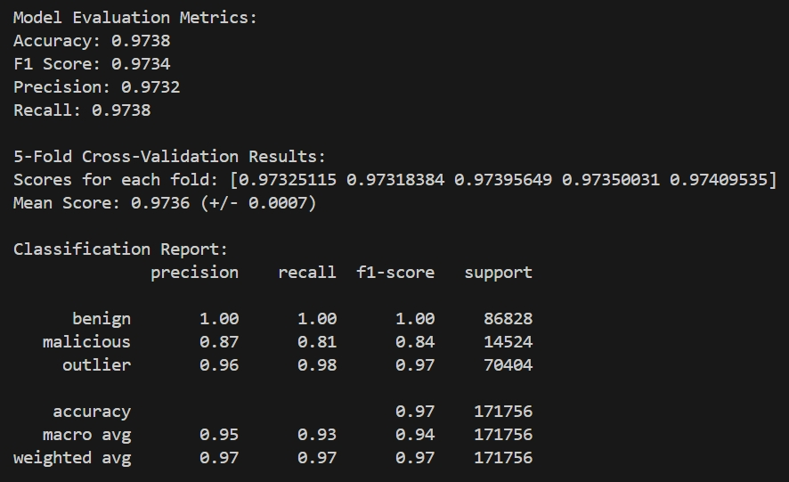

# CS 506 Final Project

### Members: Jonah Gluck (jonahg@bu.edu), Yanjia Kan(kyjbu@bu.edu), Sean McCarty(mccartys@bu.edu)

## Goal

Our goal was to explore the [LUFlow](https://www.kaggle.com/datasets/mryanm/luflow-network-intrusion-detection-data-set/data) cybersecurity data set & fit predictive machine learning models to classify benign, malicious, and outlier labels on web requests.

## Installation

To run the models, you will need the necessary data. We used a subset of the LUFlow dataset for efficiency & memory purposes. Create a data directory and add the CSV files for 12-14 of June 2022 found on the [data page](https://www.kaggle.com/datasets/mryanm/luflow-network-intrusion-detection-data-set/data) of the LUFlow dataset.

```
project/
├── data/
│   ├── 2022.06.12.csv
│   ├── 2022.06.13.csv
│   ├── 2022.06.14.csv
├── *.py files
├── Makefile
├── requirements.txt
``` 

Prerequisites

Install Python 3.7 or higher.
Clone the repository and ensure the data/ folder contains the required .csv files.

Installation

Install the necessary dependencies using pip:
```
make install
```

or 
```
pip install -r requirements.txt
```

Run Instructions

Best model for randomforest:
```
make run_rf
```

Simple Linear Model for Classification
To run the simple linear model for binary classification:
```
make run_simple
```

This script:

Uses a fully connected neural network to classify the preprocessed data.
Outputs training loss and accuracy on the test set.
ResNet-Inspired Model for Classification
To run the ResNet-inspired model for binary classification:
```
make run_resnet
```
This script:

Implements a ResNet-like architecture adapted for tabular data.
Outputs training loss and accuracy on the test set.

K-Means Model for Classification
To run the K-Means model for binary classification:
```
make run_kmeans
```

Cleaning Temporary Files

To clean up temporary files and cache:  
```
make clean
```

Dataset Information

The dataset contains network traffic features such as packet size, protocol, and entropy, along with labels for binary classification:

    Benign (0)
    Malicious (1)

Dependencies

Dependencies are listed in the requirements.txt file. Key libraries include:

    numpy and pandas for data manipulation.
    matplotlib for data visualization.
    scikit-learn for preprocessing, clustering, and evaluation.
    torch for implementing neural networks.

Example Output

    KMeans Clustering:
        Visualizes clusters based on PCA-reduced features.
        Reports clustering accuracy.

    Model Training:
        Logs training progress.
        Outputs final accuracy and confusion matrices.

Notes

Ensure that the data/ folder exists and contains the required .csv files. Modify the file paths in the scripts if the dataset structure changes.

---

# Final Report
## Dataset

***Data used:***

- The dataset we used is the public [LUFlow Dataset]([https://www.kaggle.com/path-to-dataset](https://www.kaggle.com/datasets/mryanm/luflow-network-intrusion-detection-data-set)) from Kaggle, which is a flow-based intrusion detection dataset. LUFlow contains telemetry containing emerging attack vectors through the composition of honeypots within Lancaster University's address space. The labelling mechanism is autonomous and is supported by a robust ground truth through correlation with third part Cyber Threat Intelligence (CTI) sources, enabling the constant capture, labelling and publishing of telemetry to this repository. The dataset contains 15 features and three types of labels: benign, outlier, and malicious. 

***Visualizations & insights:***

- To better understand our dataset, we plan to include a series of visualizations, such as scatter plots, heatmaps, and bar charts. These plots will help uncover relationships between features and identify patterns indicative of different classifications (benign, outlier, malicious). Insights from these visualizations will guide our feature engineering process, as well as help us pinpoint key attributes that may signal malicious behavior.
- One of the major insights was the fact that per feature, the difference between benign & malicious were apparent, while outliers seemed to be more unpredictable, meaning that a careful treatment of outliers will aid in the development of our model.  
#### Classification counts over three days:


#### Average bytes in over three days per classification:


#### Average entropy over three days per classification


***Test plan:***

- In the context of training and testing, we will use 80% of the data in the dataset to train the model, and the remaining “new” data to test and validate and check if, given the nature of the request, such a request is “evil.” We are going to use the time column to split the data for a progressive analysis as if the data is coming in real-time. Depending on the size of the dataset, we may also consider using k-fold cross-validation to improve model accuracy.  Metrics such as cross-entropy loss, confusion matrices, and others will be used to evaluate the model's performance on the test set. One limitation of this dataset is that we are limited to three days of data, but this dataset is used in published literature; therefore, we will be using it as well. 

## Feature Engineering
Our feature engineering approach transforms raw network flow data into a rich, informative representation that enables more sophisticated machine learning models. We employed several strategic techniques to enhance model predictive capabilities:

## 1. Ratio-Based Features

Ratio features reveal complex relationships between network traffic attributes:

- **Byte Ratio**: Compares incoming vs. outgoing bytes to identify data transfer patterns
- **Packet Ratio**: Analyzes the balance of incoming and outgoing packets
- **Byte-Packet Ratios**: Calculates average bytes per packet for both incoming and outgoing traffic
- **Flow Efficiency**: Measures overall data transmission efficiency by comparing total bytes to total packets

## 2. Entropy-Based Features

Entropy features help detect anomalous or unusual network behaviors:

- **Entropy per Byte**: Normalizes data randomness relative to total bytes transferred
- **Total Entropy Ratio**: Provides another perspective on data randomness
- **Bidirectional Entropy Ratio**: Compares entropy across different flow directions

## 3. Binary Indicator Features

Simple binary flags highlight critical network conditions:

- **Well-Known Port Indicators**: Flag flows originating from or targeting standard service ports (ports < 1024)

## 4. Difference-Based Features

Difference calculations expose imbalances in network traffic:

- **Byte Difference**: Net byte flow indicating data receive/send dynamics
- **Packet Difference**: Net packet flow revealing packet transmission balance

## 5. Logarithmic Transformations

Log transformations stabilize variance and improve model training:

- **Log Transformations**: Applied to bytes, duration to reduce the impact of extreme values and make patterns more discernible

## 6. Aggregation Features

Comprehensive features providing holistic network flow insights:

- **Total Bytes**: Aggregate incoming and outgoing data volume
- **Total Packets**: Combined packet count across flow directions
- **Average Bytes per Packet**: Efficiency metric for data transmission

## Results

These feature engineering techniques enabled:
- Capturing complex network traffic relationships
- Normalizing and stabilizing data representations
- Identifying critical network conditions
- Improving model accuracy (up to 94% for Improved Linear Model and CNN)

## Next Steps

Continued exploration of domain-specific feature transformations and integration of additional data sources promises further improvements in predictive capabilities.

## Models
In our journey to accurately predict outcomes using the LuFlow network dataset, we experimented with various modeling approaches, blending traditional machine learning techniques with modern deep learning methods. While each approach offered unique insights and improvements, the Random Forest classifier ultimately delivered the highest accuracy. Here's a breakdown of our efforts and findings:

***Machine Learning***

**KMeans**

Initially, we applied the KMeans algorithm to perform clustering analysis on the dataset. To simplify observation, outliers and malignant cases were grouped into label 1, while benign cases were assigned to label 0. Principal Component Analysis (PCA) was employed for dimensionality reduction, and a clustering plot based on the first and second principal components was generated. The clustering accuracy was 0.54. The plot demonstrated a significant overlap between the two clusters, making it challenging to distinguish between them. Subsequently, we attempted clustering using the first and second most important features, yielding an accuracy of only 0.48. The high degree of overlap persisted, making it difficult to establish an effective decision boundary.

**Baseline Linear Model**

Our first attempt was a simple neural network with one hidden layer—a straightforward approach to establish a performance benchmark.
Performance: Initially struggled with ~75% accuracy.


***Deep Learning***

Encouraged by the potential of deep learning, we ventured into building neural network models to see if they could surpass the performance of Random Forests.

Takeaway: The baseline model was too simplistic to capture the intricate patterns within the data, leading to lower accuracy. It also missed key functionality such as batch normalization and dropout. Our "ImprovedLinearModel" boosted accuracy to 94% on our validation set. This model added more layers, incorporated batch normalization, and implemented dropout for regularization. The 1D CNN matched the performance of the Improved Linear Model, indicating that while convolutional layers can be powerful, they didn't provide additional benefits over the enhanced fully connected architecture for our specific dataset.

**Final Model -- Random Forest**

For model selection, we primarily considered accuracy and F1 score as evaluation metrics. The final model selected was the Random Forest classifier. This choice was based on the complexity of the dataset and its suitability for multi-class classification tasks. Random Forest was preferred because it can automatically capture feature interactions, and each tree considers different feature combinations, enhancing model robustness.
In terms of optimization, grid search and cross-validation were applied. We focused on tuning four key hyperparameters:
- The number of trees (n_estimators),
- The maximum depth of the trees (max_depth),
- The minimum number of samples required to split a node (min_samples_split), and
- The minimum number of samples required to be at a leaf node (min_samples_leaf).
The first two parameters increase model complexity and enhance performance, while the latter two control tree growth to prevent overfitting. The final hyperparameter configuration was: {'max_depth': 20, 'min_samples_leaf': 3, 'min_samples_split': 2, 'n_estimators': 200}.

## Results
*Confusion Matrix*




*Performance Matrix*




